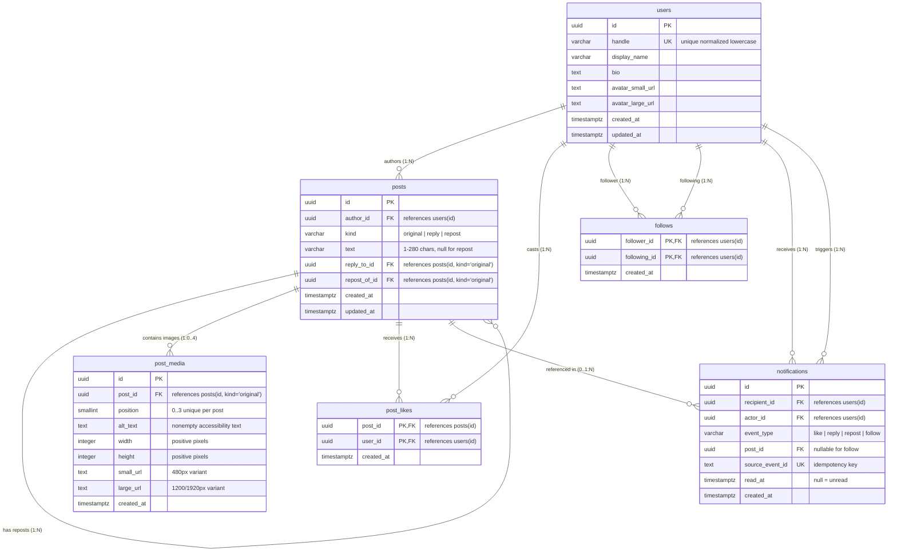

# Entity-Relationship Diagram (ERD) & Conceptual Model

**Stage:** B — Relational Modeling and SQL  
**Database:** PostgreSQL 17  
**Artifact Path:** `docs/erd.md`

---

## 1. Overview & Conceptual Architecture

The social feed relational database enforces strict integrity across users, authored posts, replies, reposts, attached media, likes, and follower graphs. Rather than treating social interactions as unconstrained JSON blobs or loosely coupled objects, this model encodes domain rules directly into relational keys, check constraints, compound foreign keys, and unique indices.

### Core Entities
1. **User (`users`)**: Represents authenticated creators, consumers, and followers. Holds normalized unique handles and profile metadata.
2. **Post (`posts`)**: Unified relational representation of originals, direct replies, and reposts using a discriminator column (`kind`).
3. **PostMedia (`post_media`)**: Ordered image attachments (0 to 4 per original post) with responsive variants, dimensions, and accessibility alt text.
4. **Like (`post_likes`)**: Many-to-many relationship linking users to liked posts with exact duplicate prevention.
5. **Follow (`follows`)**: Directed social graph edges connecting followers to followees.
6. **Notification (`notifications`)**: Event log recording user notifications with idempotency keys and target post references.

---

## 2. Mermaid Entity-Relationship Diagram

---

## 3. Cardinality and Optionality Matrix

| Relationship | Source Entity | Target Entity | Source Multiplicity | Target Multiplicity | Relational Mechanism |
|---|---|---|---|---|---|
| **Authoring** | `users` | `posts` | 1 (Mandatory) | 0..N (Optional) | `posts.author_id` NOT NULL FK referencing `users(id)` |
| **Direct Replies** | `posts` (original) | `posts` (reply) | 1 (Mandatory) | 0..N (Optional) | `posts.reply_to_id` FK referencing `posts(id, kind)` where target is 'original' |
| **Repost References**| `posts` (original) | `posts` (repost)| 1 (Mandatory) | 0..N (Optional) | `posts.repost_of_id` FK referencing `posts(id, kind)` where target is 'original' |
| **Ordered Media** | `posts` (original) | `post_media` | 1 (Mandatory) | 0..4 (Optional) | `post_media.post_id` FK referencing `posts(id)` + `position BETWEEN 0 AND 3` |
| **Post Likes** | `users` | `posts` | 0..N (Optional) | 0..N (Optional) | Associative table `post_likes` with composite PK `(post_id, user_id)` |
| **Directional Follows**| `users` (follower)| `users` (following)| 0..N (Optional)| 0..N (Optional)| Associative table `follows` with composite PK `(follower_id, following_id)` |
| **Notifications** | `users` (recipient)| `notifications`| 1 (Mandatory) | 0..N (Optional) | `notifications.recipient_id` FK referencing `users(id)` |

---

## 4. Relationship Walkthrough

### 4.1 User → Authored Posts (1 : 0..N)
- Every post (original, reply, or repost) must have exactly one author.
- A user may author zero posts (e.g. `ghost_user`) or many posts.
- Deletion policy is `ON DELETE RESTRICT` to prevent orphaned content or accidental destruction of user history.

### 4.2 Original → Direct Replies (1 : 0..N)
- A reply references exactly one target post via `reply_to_id`.
- The product rules require that a reply targets only an **original** post (replies do not chain into nested sub-replies in this phase).
- Guaranteed at the database layer through a compound foreign key referencing `(id, kind)` where `target_kind = 'original'`.

### 4.3 Original → Reposts (1 : 0..N)
- A repost references an original post via `repost_of_id`.
- A repost contains no original text content (`text IS NULL`) and no media (`media: []`).
- A user can only repost a given original once, enforced via partial unique index `(author_id, repost_of_id) WHERE kind = 'repost'`.

### 4.4 Original → Ordered Images (1 : 0..4)
- An original post may have between 0 and 4 images.
- Images cannot be attached to replies or reposts (enforced via compound FK).
- Position within the post is zero-based (`0, 1, 2, 3`), enforced via `CHECK (position BETWEEN 0 AND 3)` and composite uniqueness `UNIQUE (post_id, position)`.

### 4.5 Users ↔ Posts through Likes (M : N)
- Many users can like many posts.
- Stored in the associative table `post_likes`.
- The composite primary key `PRIMARY KEY (post_id, user_id)` guarantees that a user can like a given post at most once. Concurrent duplicate inserts are rejected or deduplicated.

### 4.6 Users ↔ Users through Directional Follows (M : N)
- Directed graph edge linking `follower_id` to `following_id`.
- Stored in `follows` with `PRIMARY KEY (follower_id, following_id)`.
- Self-following is strictly forbidden via `CHECK (follower_id <> following_id)`.
